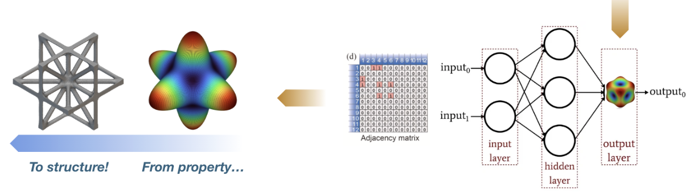
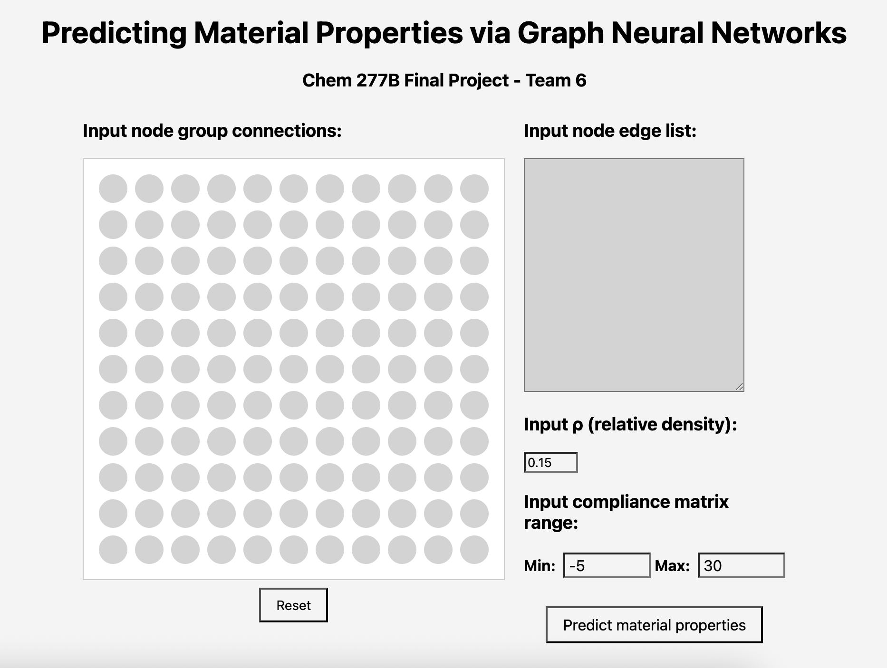

# Application of Graph Neural Networks on Predicting Material Properties from Node Group Connectivity Matrices


### Repository for the Chem 277B Final Project for Team 6.

## File Structure
```
├── app/
│   ├── app.py - Run to start web application server
├── data/
│   ├── connectivity_compliance_matrices.pkl - Pickle file containing original data
├── models/
│   ├── models.py - Contains class definitions for GNN and GAT models
│   └── saved_models/ - Checkpoints for pre-loading model configs
├── notebooks/
│   ├── data_matrix_preprocessing.ipynb - Preprocessing 
│   ├── EDA.ipynb - Exploratory data analysis
│   └── gnn_mat_prop.ipynb - Training and testing pipeline
├── presentation.pdf - Final presentation
├── pyproject.toml
├── report.pdf
├── README.md
├── scripts
└── utils/
    ├── evaluation.py - Functions for evaluation (post-training)
    ├── processing.py - Functions for preparing graph data
    └── training.py - Functions for training
```

## Interactive Web Application

To run the web application, simply run `./run_app.py` and either Ctrl+Click or paste the application server into your web browser.

## Testing
Run `./test.sh` to run tests on the utility functions used during the training/testing portion of model development.


## Contributors:
Brennan Birn, Jared Guevara, Katrina Reyes, Yichen Tang, Riya Tiloda
